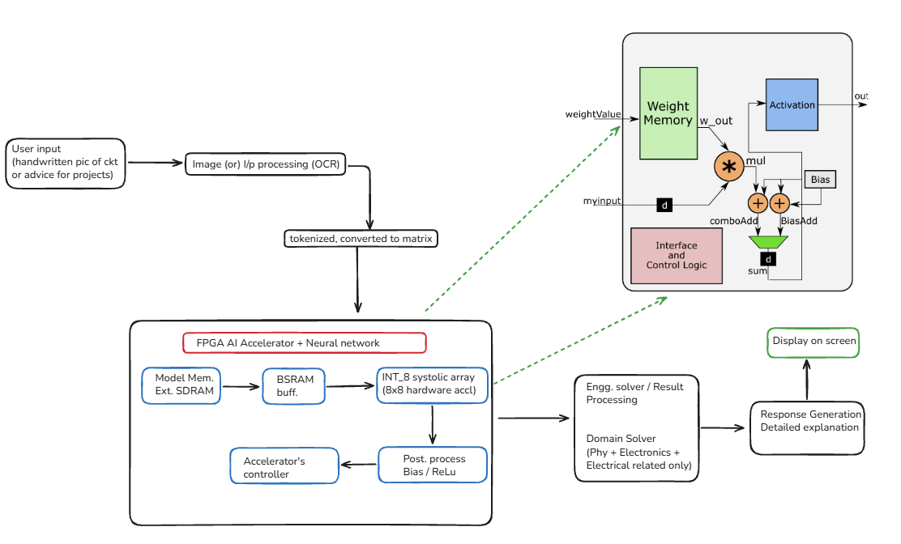
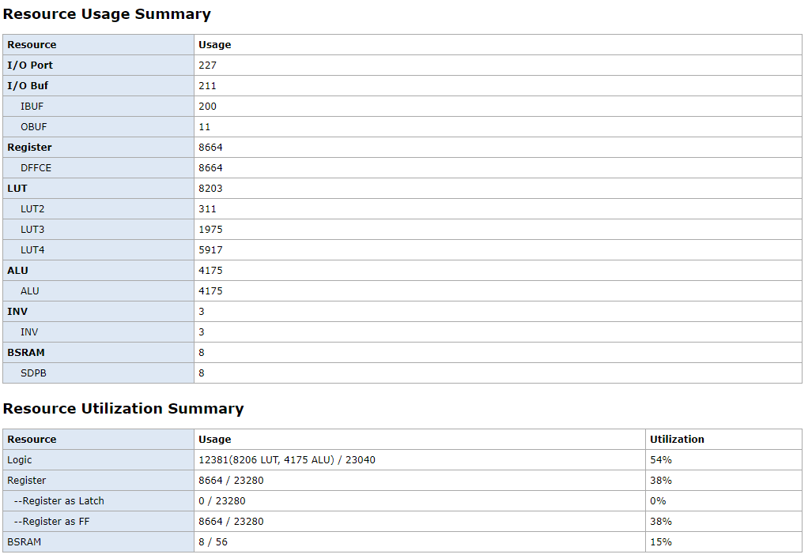
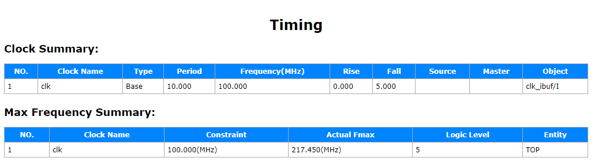

# AgentGate-V MAC Engine (AGVME)
**A 217 MHz, 100% DSP-Less Neural Network Accelerator for Ultra-Low-Cost FPGAs**

   

## Overview



The AgentGate-V MAC Engine (AGVME) is a highly optimized, 8x8 INT8 Systolic Array TPU designed to solve the Performance vs. Cost dilemma of Edge AI. 

Implemented on an ultra-constrained **₹10,000 (cheap, budget friendly) Gowin GW5A-25A FPGA**, this accelerator achieves a record-breaking **217.45 MHz** clock frequency. It does this by fundamentally rejecting standard hardware paradigms: it uses **zero hardware DSP multipliers**, implementing all 64 MAC units entirely in soft logic (LUTs) to eliminate massive physical routing penalties.

## The Architecture
To push a budget FPGA past the 200 MHz barrier, this project employs extreme pipelining and logic-gate-level optimizations:

* **100% DSP-Less Soft-Core:** By forcing the entire TPU into LUTs, the synthesizer packs the design into a tight, highly localized mesh, eliminating the crippling physical routing delay of crossing the chip to reach hard DSP blocks.
* **Radix-4 Booth Multipliers:** Standard multiplication was replaced with a custom-built, 5-stage deep-pipelined Radix-4 Booth encoder, halving the partial product tree.
* **Power-of-Two (PoT) Requantization:** The massive 32x16 hardware multiplier in the post-processor was destroyed and replaced with a zero-cost Shift-Add approximation network (e.g., data * 1.25 is computed as data + (data >>> 2)).
* **True Systolic Daisy-Chain Output:** A massive 64-to-1 global multiplexer was replaced with a sequential shift-register "bucket brigade," decongesting thousands of global routing wires.
* **Ping-Pong Buffer Hiding:** Double-buffering SRAM architecture hides all weight-load memory latency during inference.

## The Benchmark:
This project was heavily inspired by the challenge posed in standard Edge AI literature. While typical high-performance accelerators rely on expensive Xilinx Zynq boards ( - ) and max out their 100% hardware DSP allocation to hit ~150 MHz, **AGVME shatters this baseline**:

### Synthesis Results (217.45 MHz)



| Parameters | Standard Edge AI Baselines | **AGVME (This Project)** | Advantages |
| :--- | :--- | :--- | :--- |
| **Hardware Platform** | Xilinx Zynq / UltraScale+ | **Tang Primer 25K (GW5A-25A)** | High-performance AI on ultra-budget silicon. |
| **Hardware Cost** | ₹30,000 - ₹100,000+ | **₹10,000** | **3x to 10x Cost Reduction** for deployment. |
| **MAC Architecture** | 100% Hardware DSPs | **100% Soft-Core (Radix-4 Booth)** | Zero reliance on scarce, fixed-silicon blocks. |
| **Clock Frequency (Fmax)**| 100 MHz - 150 MHz | **217.45 MHz** | **~45% Faster Clock Speed**. |
| **Logic Utilization** | Highly variable | **54% (8,206 LUTs)** | Leaves half the chip empty for future expansion. |

## Repository Structure
This repository is organized to professional Silicon Valley hardware standards:
```text
final-yr-project/
├── .agents/
├── development/
│   ├── AgentGateV_MAC_Engine_Project/
│   │   ├── impl/
│   │   │   ├── gwsynthesis/
│   │   │   └── temp/
│   │   └── src/
│   ├── archive/
│   │   ├── Attempted_architectures/
│   │   │   ├── adders/
│   │   │   │   ├── carry_look_ahead_adder/
│   │   │   │   ├── full_adder/
│   │   │   │   └── half_adder/
│   │   │   ├── arithmetic/
│   │   │   │   ├── obj_dir/
│   │   │   │   └── systolic/
│   │   │   ├── Benchmark_test_against_CPU/
│   │   │   ├── controller/
│   │   │   │   └── obj_dir/
│   │   │   ├── master_controller/
│   │   │   ├── multiplier/
│   │   │   ├── obj_dir/
│   │   │   ├── ping_pong/
│   │   │   └── Verifications_assets_output_waveforms/
│   │   └── rtl/
│   ├── sim/
│   └── tb/
├── docs/
│   ├── base_paper/
│   ├── learnings/
│   ├── literature/
│   └── presentations/
│       ├── 0_review/
│       └── 1_review/
└── reference/
    ├── NN-code-verilog/
    └── ref-papers-journals-IEEE/
```

## Getting Started
1. Install [Gowin EDA](https://www.gowinsemi.com/en/support/download_eda/).
2. Open the project located at `development/agvme_project/AGVME_Synthesis.gprj`
3. Hit **Run Synthesis** to verify the 217+ MHz Fmax!

## Primary Base References
1. *Balancing Performance and Cost: FPGA-Based CNN Accelerators for Edge Computing* (The overarching motivation for cost-effective edge acceleration).
2. *Multiplication-Free Lookup-Based CNN Accelerator Using Residual Vector Quantization and Its FPGA Implementation* (The foundation for our DSP-less, multiplication-free architecture).